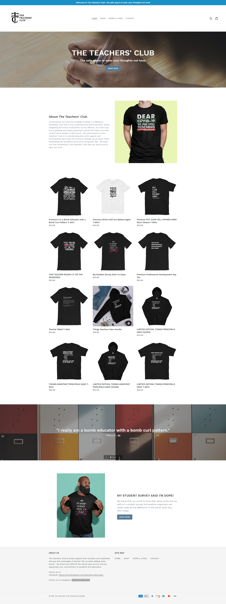
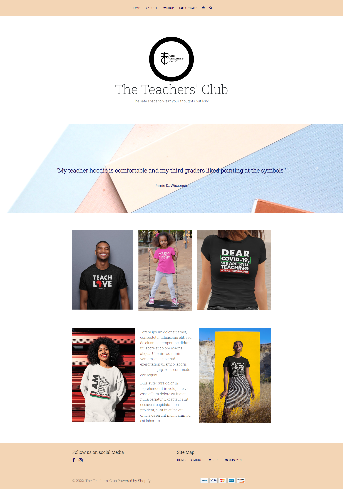
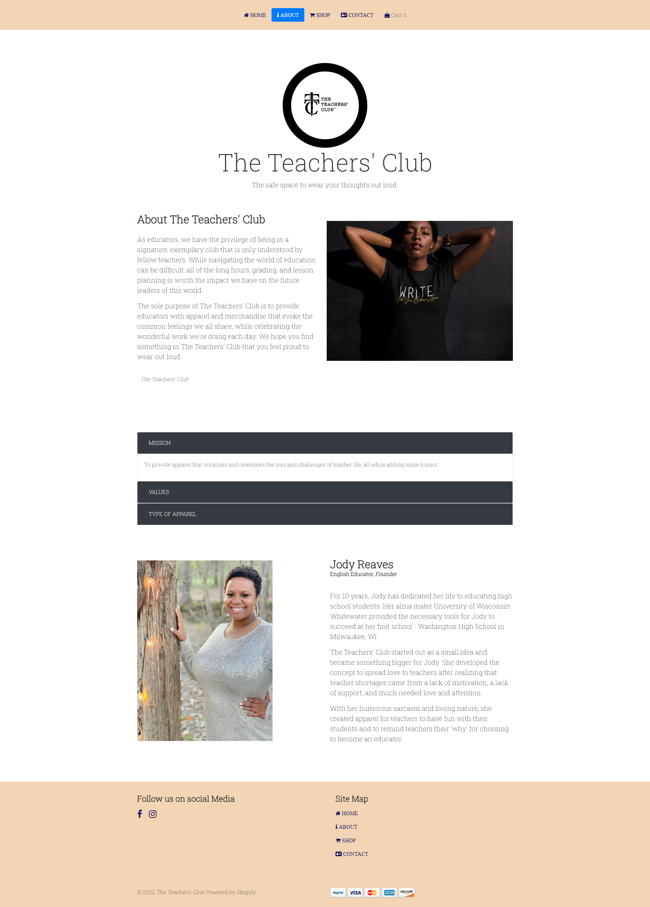
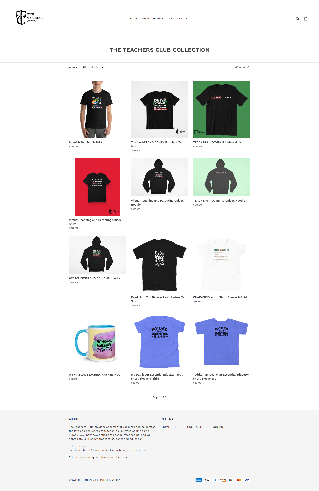
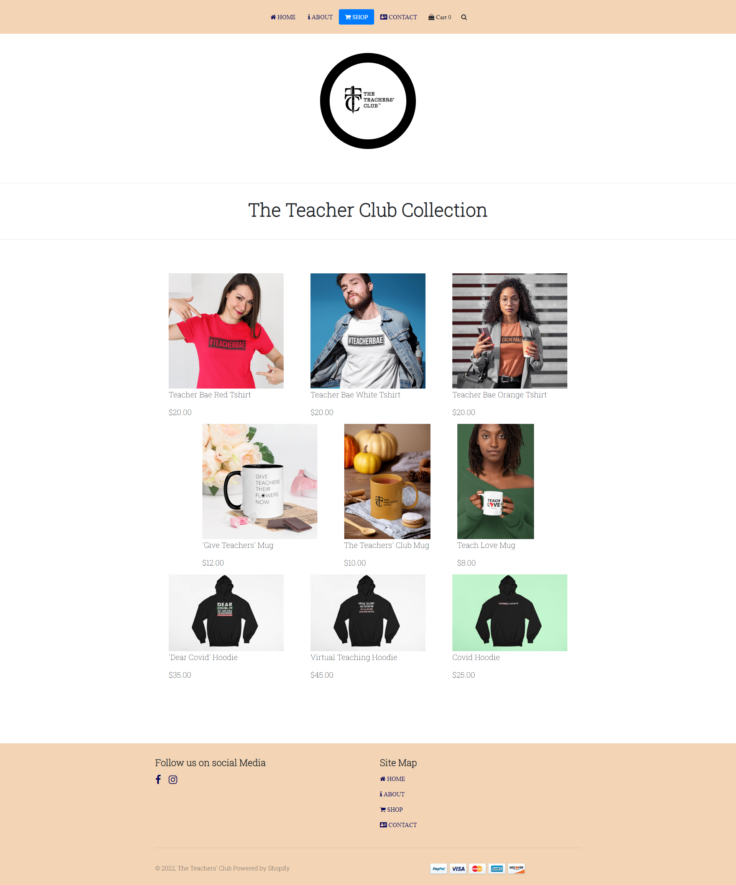
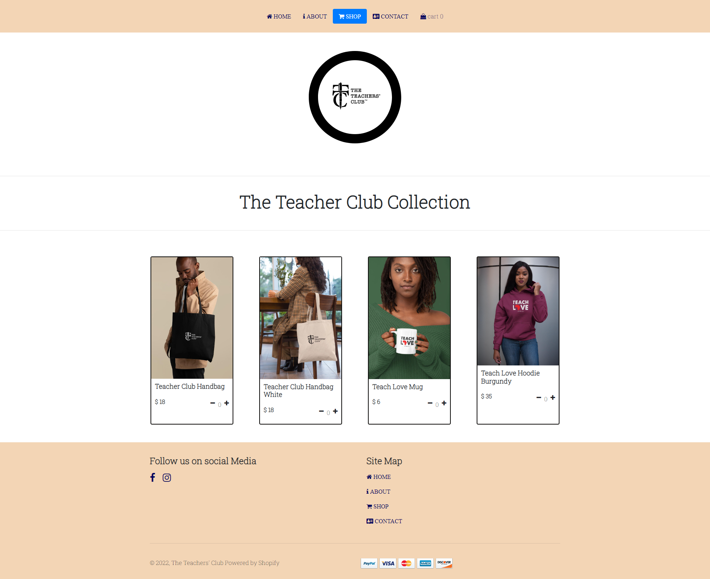
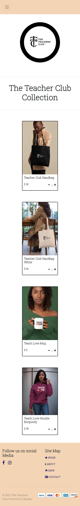
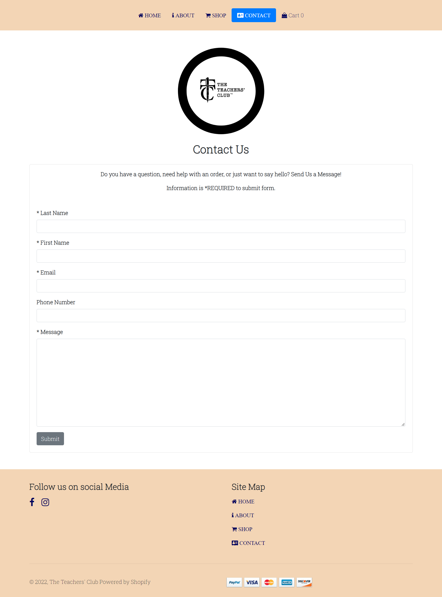
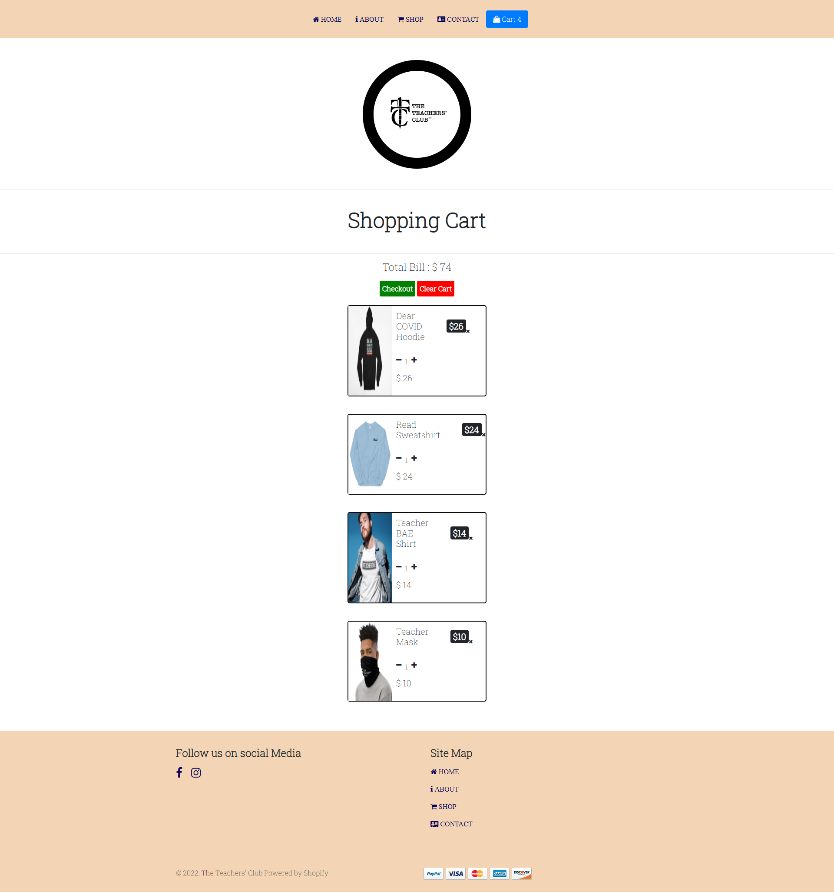

# REDEVELOPED WEBSITE WITHOUT NPM MODULES - THIS SITE USES CDN LINKS...

# The Teachers Club Website 

## An e-commerce website that promotes a safe space for teachers to voice their opinions by wearing it out loud. 

### Why an e-commerce website?

- An e-commerce possesses many characteristics, features, and programming languages that will show my strengths as a coder. The site - www.teachersclubaccess.com is owned by a teacher friend of mine named Jody Reaves who created this site to sell motivating apparel exclusively for teachers. I wanted to revamp the site to really dig into JavaScript, j Query, SASS, and bootstrap 4.0. Later on, this project will become an application for my final project in my React course. I created this project to become an official portfolio piece for my professional portfolio. This project is supported by the material that I learned from my bootcamp - Nucamp. 

### Initialization Process 

I installed the following dependencies: 
- package.json
- gitignore
- node_modules
- bootstrap 4.0
- j Query 
- Popper 
- fonts Awesome
- SASS (transpiler)

### Goals and Restructuring Process 

##### Homepage (Before)

- Declutter the homepage of about us info, shop items, and un-needed information.
- Add light coloring and powerful images to represent store's brand.
- Remove excess text and add icons as needed for user friendly accessibility. 

#### Homepage (After)

#### About Page

Jody did not have a specific About Page. Her About information was mixed with other information such as products, images, and other entities. I could not tell what her exact mission was with this company. So, I developed a separate About Page to highlight the following:

- Jody's accomplishments
- The company's mission 
- The company's values
- What the company offers

#### Shop Page (Before)

#### Shop Page (After)

As I developed this page, there are still some styling techniques I need to use to match the following features of her current page:

- Ensuring that images are the same height and width
- Aligning the images to perfection

#### Shop Page (UPDATE as of 8/26/2022)

I updated the page after experiencing some issues with the styling and the JavaScript code to get items added to the shopping cart. I used freecodecamp.com YouTube Shopping Cart video because the code was recent and up-to-date which would meet the browser standards that I am working with.

Below are images of the minimized to show the web responsiveness effects. 

- When minimized, the screen will pack the items on top of each other. 
- The images are spaced out. 
- None of the other components are smooshed together. 
- Everything appears clean and no side effects.

#### Contact Us Page

I added the "Contact Us" page to the website. It is a simple page with less wording. Later on, I will add JavaScript and databases to this page to submit real infomation. 

- Card, Card-Title, and Card Body classes were used to organize the form.
- Form element used to create form. 
- Utilized Bootstrap spacing utilizes to make the form appear clean and spaced out.
- Utilized form-control class to make the input boxes evened out. 

#### Cart Page 

The cart page consists of a fully functioning page where the user can add items, decrement the items and completely remove the items or clear the entire cart. This feature was assisted with the tutorial from freecodecamp.org. 

#### Goals for this Page

- Fixing the pixelation of the images to match
- Moving the x feature closer to the outer layer of the box
- Creating this page into a modal instead of utilizing an html page.

